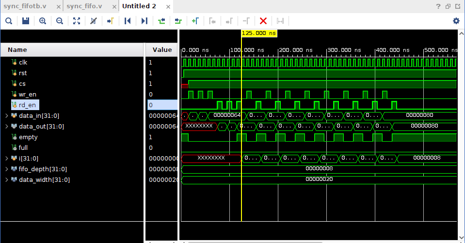
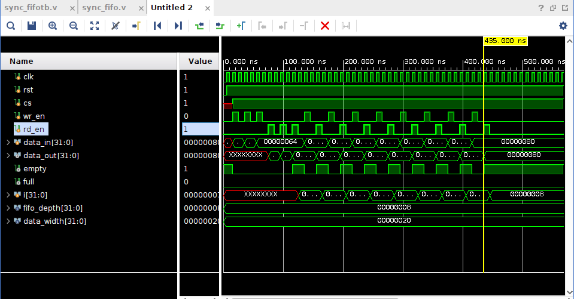
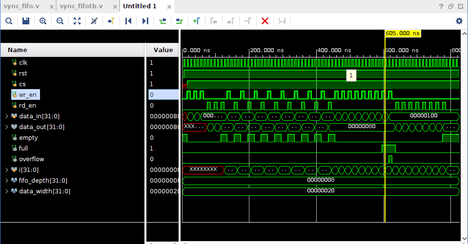
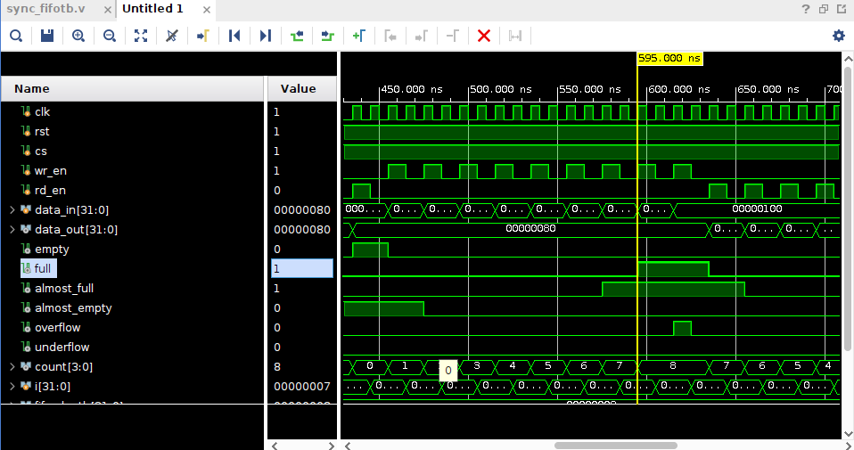
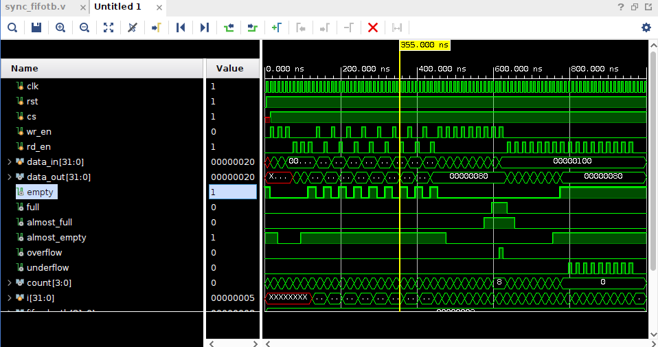
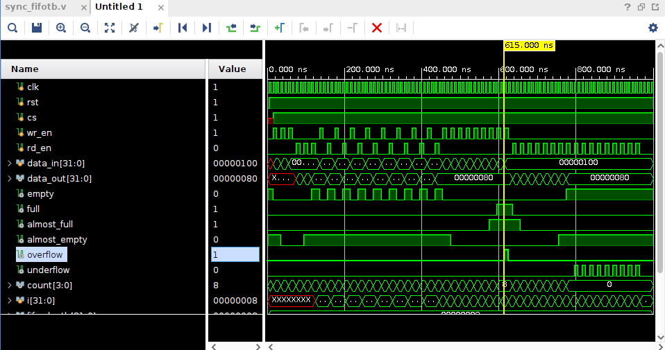
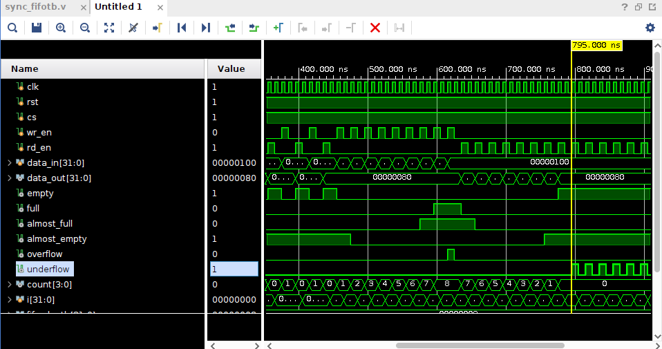
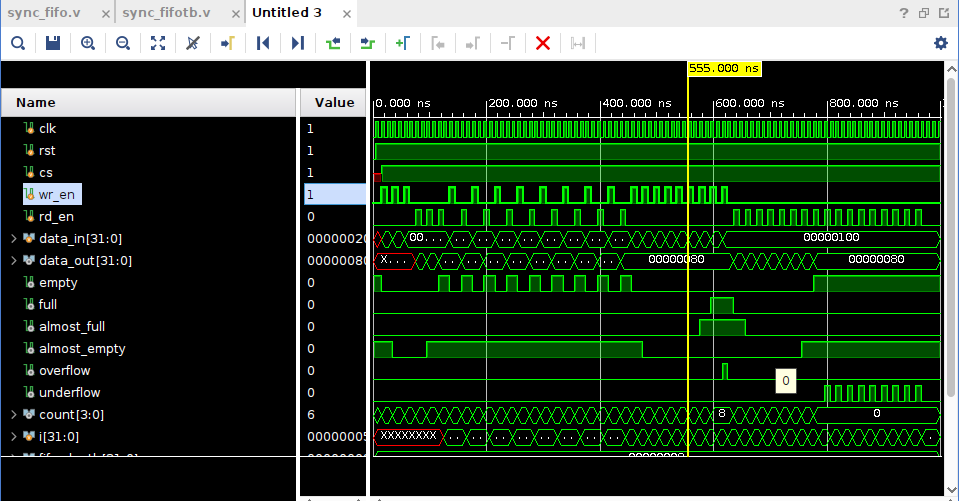

# Parameterized Synchronous FIFO (Verilog)

## Overview

This project implements a parameterized synchronous FIFO in Verilog HDL.

The design supports configurable FIFO depth and data width and includes additional status flags for robust operation.

---

## Features

- Parameterized FIFO Depth
- Parameterized Data Width
- Synchronous Read and Write
- Full Detection
- Empty Detection
- Overflow Detection
- Underflow Detection
- Occupancy Counter
- Almost Full Flag
- Almost Empty Flag

---

## Tools Used

- Vivado 2024.2
- Verilog HDL

---

## Files

sync_fifo.v      -> RTL Design

sync_fifotb.v    -> Testbench

---

## Verification

The FIFO was verified using multiple simulation scenarios including:

- Normal Write Operation
- Normal Read Operation
- Simultaneous Read/Write
- FIFO Full Condition
- FIFO Empty Condition
- Overflow Detection
- Underflow Detection
- Occupancy Counter Verification
- Almost Full Verification
- Almost Empty Verification

---

## Future Improvements

- Asynchronous FIFO
- SystemVerilog Assertions
- Functional Coverage
- UVM Testbench
---

## Verification Results

The FIFO functionality was verified through simulation in Vivado using a comprehensive SystemVerilog testbench. The following waveforms demonstrate each operating condition.

---

### 1. Normal Write Operation

**Description:**
- Data is written into the FIFO whenever `cs=1`, `wr_en=1`, and the FIFO is not full.
- The write pointer advances after every successful write.
- The occupancy counter increases by one for each write.

---

### 2. Empty Flag Verification

**Description:**
- After reset or after all stored data has been read, the FIFO becomes empty.
- The `empty` flag is asserted.
- No further read operation is allowed until new data is written.

---

### 3. Full Flag Verification

**Description:**
- When the FIFO reaches its maximum storage capacity, the `full` flag is asserted.
- Additional write requests are blocked to prevent memory corruption.
- The occupancy counter reaches the FIFO depth.

---

### 4. Almost Full Flag Verification

**Description:**
- The `almost_full` flag is asserted when only one storage location remains available.
- This early warning signal allows upstream logic to stop sending data before the FIFO becomes completely full.

---

### 5. Almost Empty Flag Verification

**Description:**
- The `almost_empty` flag becomes active when only one data element remains inside the FIFO.
- This warning allows downstream logic to prepare for an empty FIFO condition.

---

### 6. Overflow Detection

**Description:**
- An overflow occurs when a write operation is attempted while the FIFO is already full.
- The write request is ignored.
- The `overflow` flag is asserted for one clock cycle.
- FIFO contents remain unchanged.

---

### 7. Underflow Detection

**Description:**
- An underflow occurs when a read operation is attempted while the FIFO is empty.
- No data is read.
- The `underflow` flag is asserted for one clock cycle.
- FIFO pointers remain unchanged.

---

### 8. Occupancy Counter Verification

**Description:**
- The occupancy counter continuously tracks the number of valid data entries stored in the FIFO.
- The counter increments on every successful write.
- The counter decrements on every successful read.
- During simultaneous valid read and write operations, the counter value remains unchanged.

